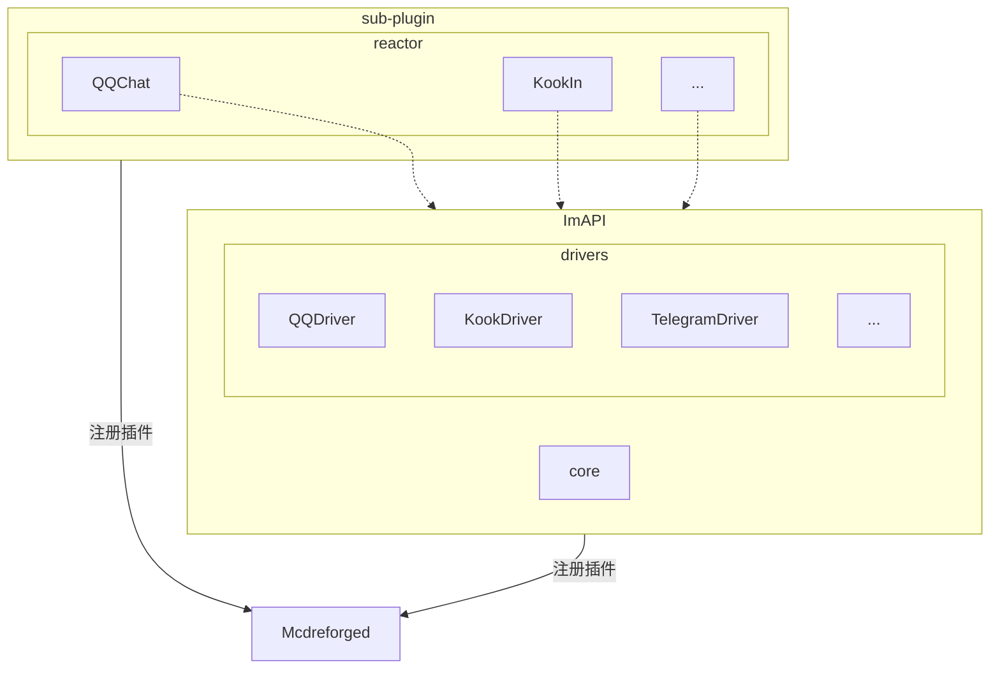
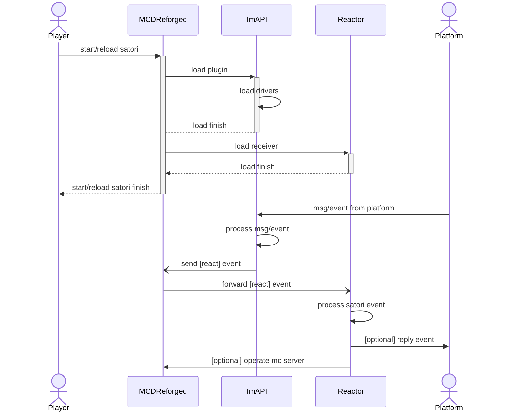
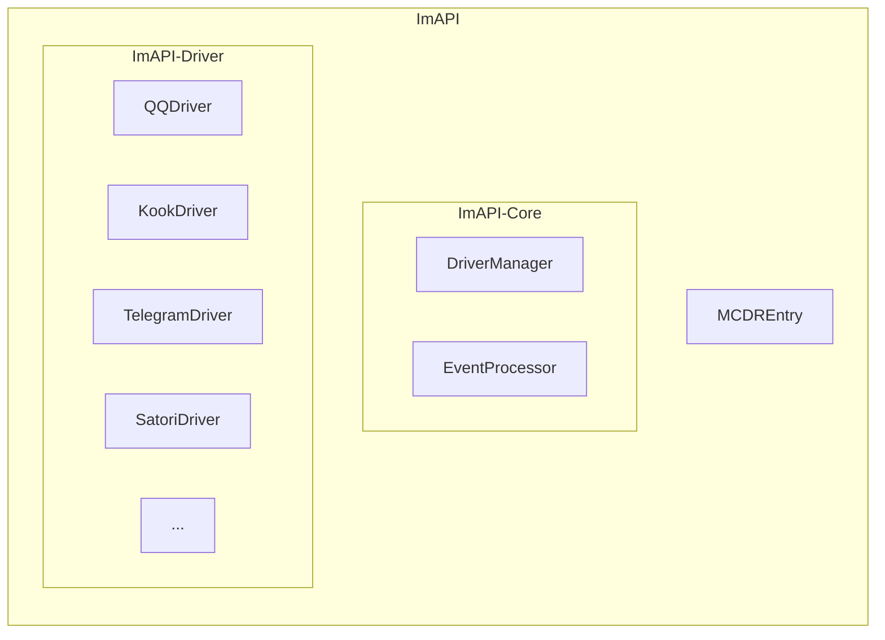

# ImAPI架构

## 概要说明

以ImAPI作为核心插件的架构，主要有如下几个角色

1. **外部系统**: 与MCDR互通且ImAPI支持的其他im平台，例如QQ，Kook，Discord，Telegram等
2. **ImAPI**: 事件处理的核心插件，负责将所有来自各个平台的消息与事件做统一处理，并封装成统一格式的事件(Event)进行广播
3. **Reactor**: 可扩展的、与平台协议解耦的应用层，基于ImAPI的事件进行响应与处理。在MCDR的插件关系上，Reactor插件依赖ImAPI

## 插件树

## 注册与加载流程

### 概述

1. SatoriAPI加载时，根据配置文件启动对应的receiver
2. Reactor加载时，向MCDR发送register事件，ImAPI会监听这个事件，将对应插件添加到注册表

### 加载流程图

## 主要事件
考虑借鉴[Satori协议](https://satori.js.org)的通信方式进行事件通信

## License

Copyright © 2025 [MCDReforged-Towhee-Community](https://github.com/MCDReforged-Towhee-Community) and Contributors

This program is free software: you can redistribute it and/or modify it under the terms of the GNU General Public License as published by the Free Software Foundation, either version 3 of the License, or (at your option) any later version.

This program is distributed in the hope that it will be useful, but WITHOUT ANY WARRANTY; without even the implied warranty of MERCHANTABILITY or FITNESS FOR A PARTICULAR PURPOSE. See the GNU General Public License for more details.

You should have received a copy of the GNU General Public License along with this program. If not, see <https://www.gnu.org/licenses/>.

本程序是自由软件：你可以再分发之和/或依照由自由软件基金会发布的 GNU 通用公共许可证修改之，无论是版本 3 许可证，还是（按你的决定）任何以后版都可以。