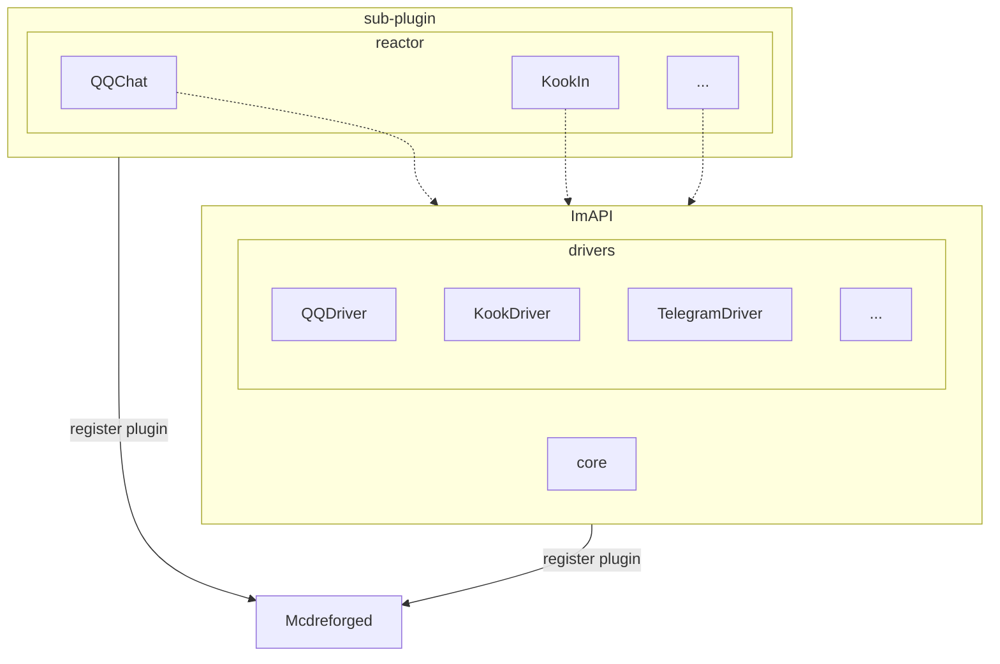
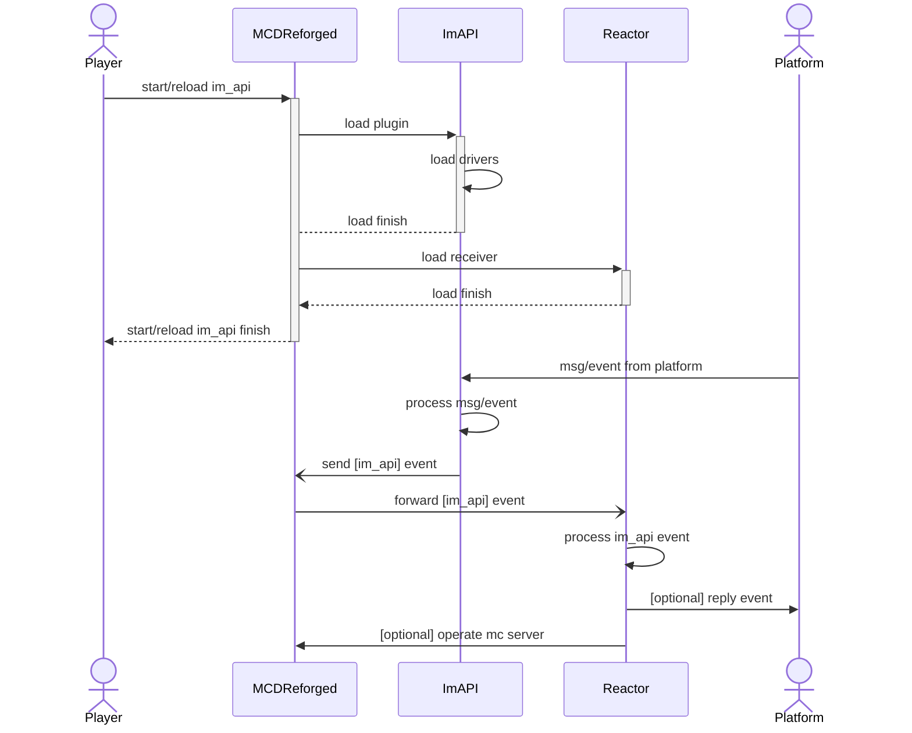
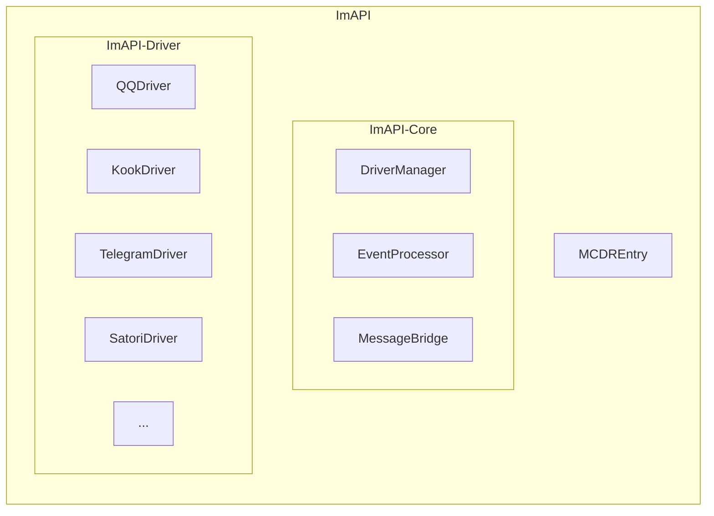

# ImAPI Architecture Overview

## System Roles

The ImAPI architecture includes the following main roles:

1. **External Systems**: Other IM platforms supported by ImAPI that interact with MCDR, such as QQ, Kook, Discord, Telegram, etc.
2. **ImAPI**: The core plugin for event processing, responsible for unifying and processing messages and events from various platforms, and broadcasting them as standardized events
3. **Reactor**: An extensible application layer decoupled from platform protocols, responding to and processing events based on ImAPI. In terms of MCDR plugin relationships, Reactor plugins depend on ImAPI

## Plugin Tree

## Core Components

### ImAPI Core

The core components of ImAPI include:

1. **MCDREntry**: Plugin entry point, responsible for initializing and managing ImAPI's lifecycle
2. **DriverManager**: Driver manager, responsible for managing driver instances for various platforms
3. **EventProcessor**: Event processor, handles messages and events from various platforms
4. **MessageBridge**: Message bridge, responsible for forwarding messages between different platforms

### ImAPI Driver

The driver layer implements specific communication with various platforms:

1. **QQDriver**: QQ platform driver
2. **KookDriver**: Kook platform driver
3. **TelegramDriver**: Telegram platform driver
4. **SatoriDriver**: Satori protocol driver

## Registration and Loading Process

### Overview

1. When ImAPI loads, it starts corresponding receivers based on the configuration file
2. When Reactor loads, it sends a register event to MCDR, and ImAPI listens to this event to add the corresponding plugin to the registry

### Loading Flow Chart

### Component Relationship Diagram

