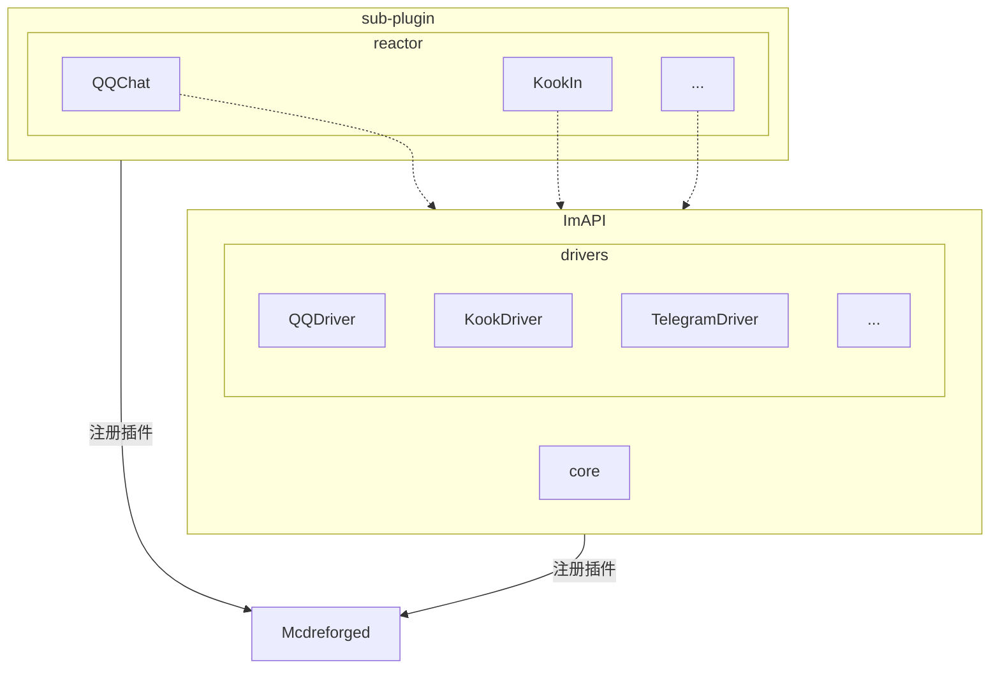
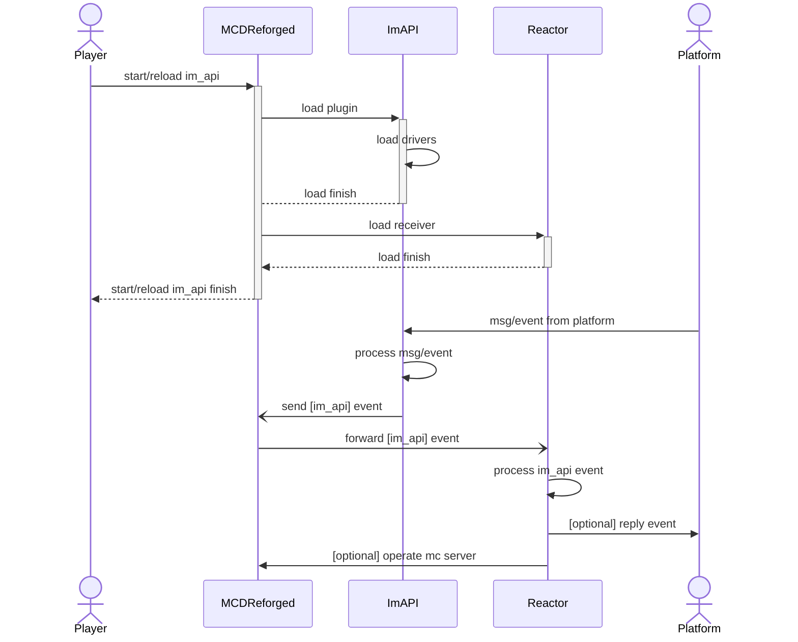
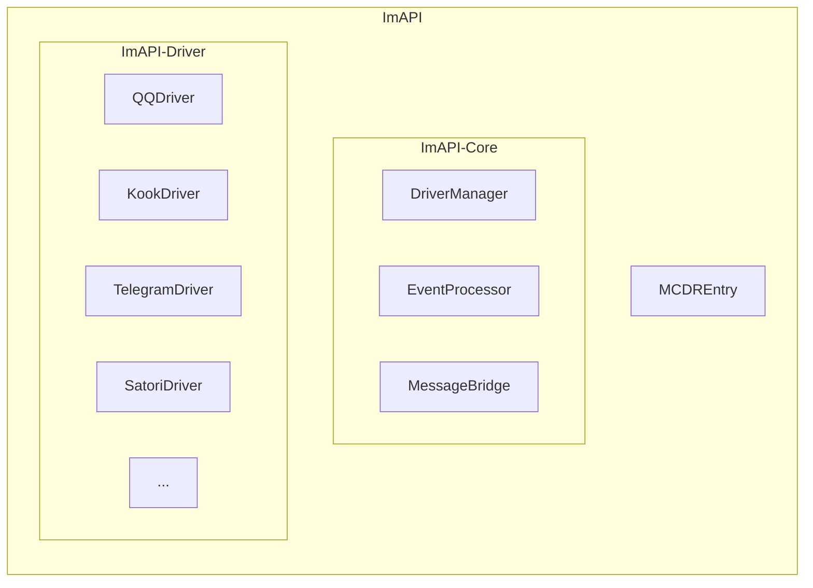

# ImAPI 架构说明

## 系统角色

在ImAPI架构中，主要包含以下几个角色：

1. **外部系统**: 与MCDR互通且ImAPI支持的其他im平台，例如QQ，Kook，Discord，Telegram等
2. **ImAPI**: 事件处理的核心插件，负责将所有来自各个平台的消息与事件做统一处理，并封装成统一格式的事件(Event)进行广播
3. **Reactor**: 可扩展的、与平台协议解耦的应用层，基于ImAPI的事件进行响应与处理。在MCDR的插件关系上，Reactor插件依赖ImAPI

## 插件树

## 核心组件

### ImAPI Core

ImAPI的核心组件包括：

1. **MCDREntry**: 插件入口，负责初始化和管理ImAPI的生命周期
2. **DriverManager**: 驱动管理器，负责管理各个平台的驱动实例
3. **EventProcessor**: 事件处理器，处理来自各个平台的消息和事件
4. **MessageBridge**: 消息桥接器，负责在不同平台间转发消息

### ImAPI Driver

驱动层实现了与各个平台的具体通信：

1. **QQDriver**: QQ平台驱动
2. **KookDriver**: Kook平台驱动
3. **TelegramDriver**: Telegram平台驱动
4. **SatoriDriver**: Satori协议驱动

## 注册与加载流程

### 概述

1. ImAPI加载时，根据配置文件启动对应的receiver
2. Reactor加载时，向MCDR发送register事件，ImAPI会监听这个事件，将对应插件添加到注册表

### 加载流程图

### 组件关系图

